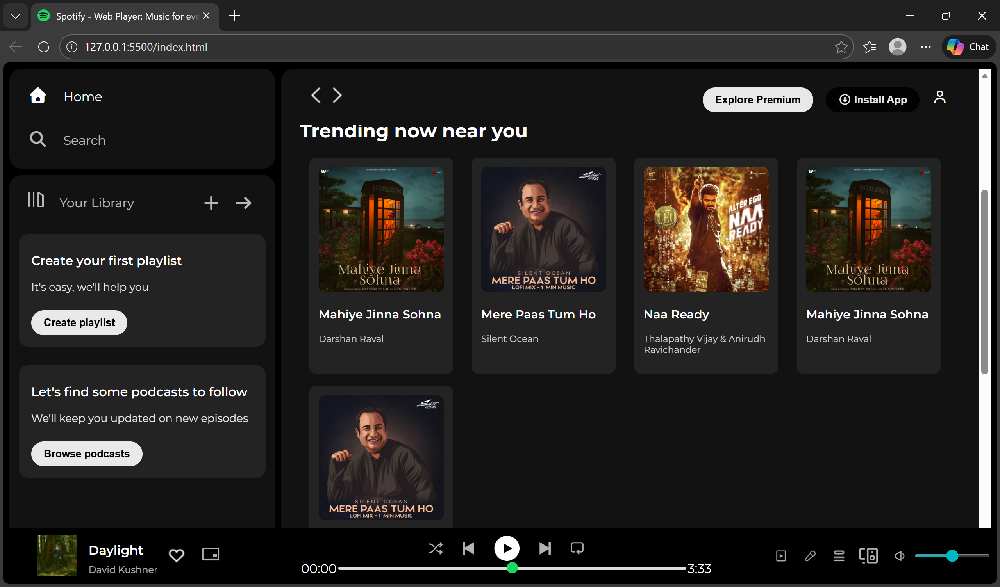

# 🎵 SPOTIFY-CLONE (PURE-CSS)

A **Spotify frontend UI clone** built using **pure HTML and CSS**, without any JavaScript. This project focuses on layout design, styling, and responsiveness while replicating the look and feel of Spotify’s web interface.
>🎓 Developed while learning web development under the guidance of Apna College.
---

## ✨ Features

* 🎧 Spotify-inspired user interface
* 🎨 Clean and modern layout design
* 🖥️ Responsive for PC and tablet screen sizes
* 🚫 No JavaScript used (Pure CSS)
* 🧩 Flexbox-based layout

---

## 🛠️ Tech Stack

* **HTML5**
* **CSS3** (Flexbox, positioning)

---

## 📂 Project Structure

```
SPOTIFY-CLONE-PURE-CSS/
├── index.html
├── style.css
├── assets/
│   └── images/
├── H-assets/
│   └── images/
├── Screenshot
└── README.md
```

---

## 🚀 Getting Started

1. Clone the repository:

   ```bash
   git clone https://github.com/Akarsh-Coding/Spotify-Clone--Pure-CSS-.git
   ```
2. Open `index.html` in your browser.

---

## 📌 Usage

This project can be used as:

* A frontend UI practice project
* A CSS layout and styling reference
* A portfolio project for beginners

---

## 📸 Preview



---

## 🧑‍💻 Author

**Akarsh Kumar**

---

## 📄 License

This project is created for learning and educational purposes only.

---

⭐ If you like this project, don’t forget to give it a star on GitHub!
